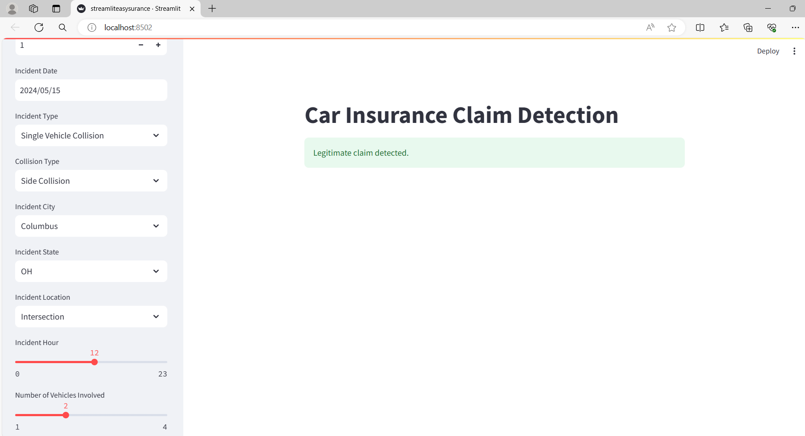
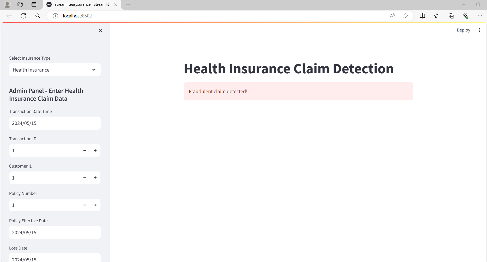

# Insurance Fraud Detection

## Overview

This project aims to detect fraudulent health and car insurance claims using machine learning models. The project is built using Streamlit for the user interface and employs Decision Tree Classifiers for the detection. The models are trained on separate datasets for health and car insurance claims.

## Table of Contents

- [Overview](#overview)
- [Features](#features)
- [Installation](#installation)
- [Usage](#usage)
- [Demo](#demo)
- [Contributing](#contributing)
- [License](#license)

## Features

- **Real-time Fraud Detection**: Detects fraudulent claims in real-time using trained models.
- **Interactive Interface**: User-friendly interface built with Streamlit.
- **Separate Models**: Different models for health and car insurance claims.
- **Visualization**: Visual representation of class distribution in the datasets.

## Installation

To get started with this project, follow these steps:

1. **Clone the repository:**

   ```bash
   git clone https://github.com/yourusername/InsuranceFraudDetection.git
   cd InsuranceFraudDetection

   ```

2. **Create a virtual environment:**

   bash
   python -m venv venv
   source venv/bin/activate # On Windows use `venv\Scripts\activate`

3. **Install the required packages:**

   bash
   pip install -r requirements.txt

4. **Download the datasets:**
   Place the insurance_dataset.xlsx and health_insurance_data.csv files in the root directory of the project.

## Usage

### To use the Insurance Fraud Detection system, follow these steps:

1. **Run the Streamlit application:**

   bash
   streamlit run streamliteasysurance.py

2. **Select the Insurance Type:**
3. **Use the sidebar to select either "Car Insurance" or "Health Insurance".**
4. **Enter the Claim Data:**
   Fill in the required fields in the sidebar based on the selected insurance type.
5. **Submit the Data:**
   Click the "Submit" button to get the fraud detection result.

## Demo

Here is a demo result of the fraud detection:



## Acknowledgements

    Streamlit
    Pandas
    NumPy
    Matplotlib
    Seaborn
    scikit-learn
